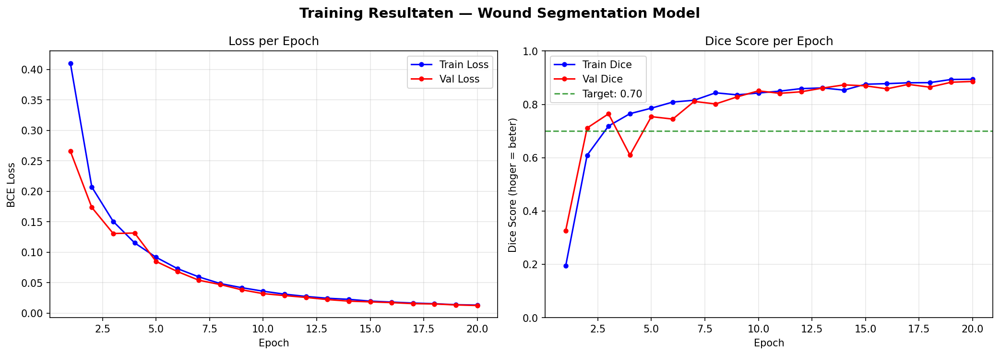

# wound-tissue-segmentation
AI model for wound tissue classification - Red/Yellow/Black tissue detection
# Wound Tissue Segmentation

During my years as a registered nurse, wound assessment was part 
of my daily routine. We documented tissue types using TIME 
reporting — tracking the percentage of red, yellow, and black 
tissue in a wound to monitor healing progress.

The problem I kept running into: it was highly subjective. A 
morning nurse would document 80% red tissue. The evening nurse 
would look at the same wound and write 50%. Same patient, same 
wound, different eyes.

That inconsistency stuck with me. When I started studying AI, 
this felt like an obvious problem to tackle — can a model look 
at a wound photo and give a consistent, objective tissue 
breakdown that doesn't change depending on who's on shift?

This project is my attempt at that.

**Nika de Vries — Applied Data Science & AI, De Haagse Hogeschool**  
Former registered nurse, now studying AI.

---

## What it does

Upload a wound photo. The model finds the wound, analyses the 
tissue colours inside it, and returns a percentage breakdown.

| Tissue | Colour | Clinical meaning |
|--------|--------|-----------------|
| Granulation | 🔴 Red | Healthy, healing tissue |
| Fibrin/Slough | 🟡 Yellow | Stalling or infected |
| Necrosis | ⚫ Black | Dead tissue |

This maps directly onto the T (Tissue) component of TIME 
wound assessment — the same framework I used at the bedside.

## Results




---

## Performance

Trained on 986 wound images. Validation Dice score: **0.8861** 
after 20 epochs. Architecture: U-Net + ResNet34 (PyTorch).

---

## Try it

Open in Google Colab and run the cells top to bottom. 
Upload your own image in the last cell.

[](https://colab.research.google.com)

```bash
pip install segmentation-models-pytorch albumentations torch
```

---

## Data & credits

Dataset: Wang et al. (2020). Fully Automatic Wound Segmentation 
with Deep Convolutional Neural Networks. Scientific Reports.  
https://doi.org/10.1038/s41598-020-78799-w

Model architecture via segmentation-models-pytorch  
https://github.com/qubvel/segmentation_models.pytorch

The HSV-based tissue colour analysis is my own addition.

---

## Disclaimer

Research project built as part of my AI studies. Not validated 
for clinical use. Do not use for medical decisions.
